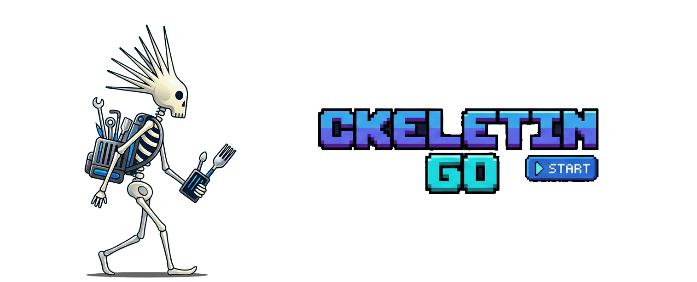

<div align="center">



**A production-ready Go CLI scaffold powered by an updatable framework layer.**

<!-- Row 1: Build Quality & Security -->
[](https://github.com/peiman/ckeletin-go/actions/workflows/ci.yml)
[](https://codecov.io/gh/peiman/ckeletin-go)
[](https://goreportcard.com/report/github.com/peiman/ckeletin-go)
[](https://github.com/peiman/ckeletin-go/security/code-scanning)

<!-- Row 2: Project Metadata -->
[](https://github.com/peiman/ckeletin-go/releases)
[](LICENSE)
[](https://pkg.go.dev/github.com/peiman/ckeletin-go)
[](https://github.com/peiman/ckeletin-go/blob/main/go.mod)

<!-- Row 3: Community & Activity -->
[](https://github.com/peiman/ckeletin-go/stargazers)
[](https://github.com/peiman/ckeletin-go/commits/main)
[](CONTRIBUTING.md)

</div>

---

## TL;DR

ckeletin-go gives you production-ready CLI infrastructure — clean architecture, enforced patterns, and an updatable framework — so you can focus on your feature.

- **Built for humans and AI agents** — `AGENTS.md`, `CLAUDE.md`, hooks, and automated enforcement mean AI coding agents produce correct, well-structured code from day one
- **Updatable framework** — `.ckeletin/` updates independently via `task ckeletin:update`. Your code is never touched. AI agent infrastructure improves automatically
- **Read the code in 5 minutes** — Ultra-thin commands (~20 lines each). No framework magic to decode
- **Ship with ≥85% test coverage** — Hundreds of real tests. Integration + unit. Every rule is machine-checkable
- **One command setup** — `task init name=myapp module=...` updates 40+ files. Start coding in 2 minutes

**Quickstart:**
```bash
git clone https://github.com/peiman/ckeletin-go.git && cd ckeletin-go
task setup && task init name=myapp module=github.com/you/myapp
task build && ./myapp ping
```

**Bonus:** Automatic GPL/AGPL blocking prevents license contamination.

---

## What You Get

ckeletin-go is both a **scaffold** (fork, customize, ship) and a **framework** (updatable infrastructure that keeps working for you):

```
myapp/
├── .ckeletin/              # FRAMEWORK — updated via `task ckeletin:update`
│   ├── Taskfile.yml        # Quality checks, build tasks, validation
│   ├── pkg/                # Config registry, logger, testutil packages
│   ├── scripts/            # Enforcement scripts (architecture, patterns, security)
│   └── docs/adr/           # Framework ADRs (000-099)
│
├── cmd/                    # YOUR commands (ultra-thin, ≤30 lines)
├── internal/               # YOUR business logic
├── pkg/                    # YOUR public reusable packages
├── docs/adr/               # YOUR ADRs (100+)
├── Taskfile.yml            # YOUR task aliases + custom tasks
└── .golangci.yml           # YOUR tool configs (customize freely)
```

**The scaffold** gets you started: clone, `task init`, customize `cmd/` and `internal/`, ship.

**The framework** keeps working: enforced architecture, validated patterns, type-safe config, structured logging — all updated independently of your code via `task ckeletin:update`.

**AI agents work here too.** The framework includes layered AI configuration — `AGENTS.md` for any AI assistant, `CLAUDE.md` for Claude Code, automated hooks, and behavioral rules — so coding agents follow the same enforced patterns you do. When the framework updates, your AI agent's effectiveness improves with it.

---

## Key Highlights

- **Agent-Ready Architecture**: Layered AI configuration (`AGENTS.md` → `CLAUDE.md` → hooks → enforcement) means coding agents produce correct code within your architecture — not despite it
- **Updatable Framework**: `.ckeletin/` updates independently of your code. Patterns, tooling, and AI agent infrastructure evolve together
- **Readable Code**: Ultra-thin commands (~20 lines each) — understand and modify in minutes
- **Enforced Quality**: ≥85% test coverage, automated architecture validation, pre-commit hooks. Every rule is machine-checkable
- **Enterprise License Compliance**: Automated GPL/AGPL blocking prevents legal contamination
- **Task-Based Workflow**: Single source of truth for all commands — local, CI, and AI agents use the same interface ([ADR-000](.ckeletin/docs/adr/000-task-based-single-source-of-truth.md))
- **Reproducible Builds**: Pinned tool versions ensure identical results everywhere
- **Crafted to Learn From**: 14 ADRs explain every architectural decision. The codebase isn't just functional — it's reasoned

---

## Agent-Ready Architecture

Most scaffolds produce code that AI agents can write *in* but not write *well in*. Agents guess at conventions, misconfigure flags, and drift from intended patterns. ckeletin-go solves this with **enforcement by automation** — every architectural rule is machine-checkable, so violations are caught whether the code comes from a human or an AI.

### The AI Configuration Stack

```
AGENTS.md          → Universal project guide (any AI assistant)
CLAUDE.md          → Claude Code-specific behavioral rules
.claude/rules/     → Granular rules loaded automatically
.claude/hooks.json → Auto-installs tools, validates commits
task check         → Single gateway that catches all violations
```

**`AGENTS.md`** gives any AI agent complete project context: architecture, commands, conventions, testing thresholds, and decision trees. It's structured as a specification, not prose — designed for machine consumption.

**`CLAUDE.md`** adds Claude Code-specific rules: mandatory task commands, code placement decision trees, priority cascade (Security → License → Correctness → Coverage → Style).

**Hooks and enforcement** close the loop. SessionStart hooks auto-install tools. Pre-commit hooks validate changes. `task check` runs the same quality gates regardless of who wrote the code.

### Why This Matters

- **Determinism**: `task test` always runs the right flags. Agents don't guess `go test -race -coverprofile=... -count=1 ./...`
- **Architectural memory**: ADRs explain *why* patterns exist, preventing agents from optimizing away guardrails they don't understand
- **Automated enforcement**: 14 ADRs, each with machine-checkable validation. No honor system
- **Framework evolution**: `task ckeletin:update` improves the AI configuration alongside everything else

### Using With AI Agents

**Claude Code**: Reads `CLAUDE.md` and `.claude/rules/` automatically. Hooks fire on session start. No configuration needed.

**Cursor / Copilot / Codex**: Point your agent at `AGENTS.md` for full project context. The task-based workflow and automated enforcement work with any tool.

**The pattern is reusable.** The `AGENTS.md` → rules → hooks → enforcement approach works in any codebase. ckeletin-go is a reference implementation.

---

## Quick Start

1. **Clone and set up tools:**
   ```bash
   git clone https://github.com/peiman/ckeletin-go.git
   cd ckeletin-go
   task setup
   ```

2. **Initialize with your project details:**
   ```bash
   task init name=myapp module=github.com/you/myapp
   ```
   This updates module path, imports (40+ files), binary name, and config — automatically.

3. **Build and run:**
   ```bash
   task build
   ./myapp ping
   ```

---

## Architecture

ckeletin-go follows a principled architecture with automated enforcement:

- **Layered architecture** — 4-layer pattern (Entry → Command → Business Logic → Infrastructure) with validation ([ADR-009](.ckeletin/docs/adr/009-layered-architecture-pattern.md))
- **Ultra-thin commands** — ~20-30 lines, delegate to business logic ([ADR-001](.ckeletin/docs/adr/001-ultra-thin-command-pattern.md))
- **Centralized configuration** — Type-safe registry with auto-generated constants ([ADR-002](.ckeletin/docs/adr/002-centralized-configuration-registry.md))
- **Dependency injection** — Over mocking, for testability ([ADR-003](.ckeletin/docs/adr/003-dependency-injection-over-mocking.md))
- **Dual-tool license compliance** — Source + binary analysis ([ADR-011](.ckeletin/docs/adr/011-license-compliance.md))
- **Dev-only commands** — Via build tags ([ADR-012](.ckeletin/docs/adr/012-dev-commands-build-tags.md))
- **Every ADR enforced** — By automation, not code review alone ([ADR-014](.ckeletin/docs/adr/014-adr-enforcement-policy.md))

All architectural decisions are documented in **[Architecture Decision Records](docs/adr/)**.

---

## Features

- **Modular Command Structure**: Add, remove, or update commands without breaking the rest
- **Layered Architecture**: Enforced 4-layer pattern with automated validation to prevent drift
- **Structured Logging**: Zerolog dual output (console + file) for debugging and production
- **Bubble Tea UI**: Optional interactive terminal UIs
- **Single-Source Configuration**: Defaults in config files, overrides via env vars and flags
- **Enterprise License Compliance**:
  - Dual-tool checking: go-licenses (source, ~2-5s) + lichen (binary, ~10-15s)
  - Automatic GPL/AGPL blocking — default permissive-only policy (MIT, Apache-2.0, BSD)
  - See [ADR-011](.ckeletin/docs/adr/011-license-compliance.md) and [docs/licenses.md](docs/licenses.md)
- **Task Automation**: One Taskfile for all build, test, and lint commands
- **High Test Coverage**: ≥85% enforced by CI. Hundreds of real tests
- **Beautiful Check Output**: `pkg/checkmate` — thread-safe, TTY-aware terminal output library

---

## Getting Started

### Prerequisites

- **Go**: Version specified in `go.mod`
- **Task**: Install from [taskfile.dev](https://taskfile.dev/#/installation)
- **Git**: For version control

### Installation

#### Download Pre-built Binary

```bash
# Example for Linux amd64
curl -L https://github.com/peiman/ckeletin-go/releases/latest/download/ckeletin-go_linux_amd64.tar.gz | tar xz
sudo mv ckeletin-go /usr/local/bin/
```

#### Homebrew (macOS/Linux)

```bash
brew install peiman/tap/ckeletin-go
```

**Note**: Homebrew tap is optional and must be explicitly enabled by the project maintainer.

#### Build from Source

```bash
git clone https://github.com/peiman/ckeletin-go.git
cd ckeletin-go
task setup && task build
```

### Using the Scaffold

```bash
task init name=myapp module=github.com/myuser/myapp
```

This single command:
- Updates module path in `go.mod` and all imports (40+ files)
- Updates binary name in `Taskfile.yml` and `.goreleaser.yml`
- Cleans `pkg/` (ckeletin-go libraries become external dependencies)
- Formats code and runs `go mod tidy`

Then build and test:
```bash
task check    # Run quality checks
task build    # Build your binary
./myapp --version
```

---

## Configuration

Viper-based configuration with a centralized registry ([ADR-002](.ckeletin/docs/adr/002-centralized-configuration-registry.md)):

### Configuration Precedence

1. Command-line flags (highest priority)
2. Environment variables
3. Configuration file
4. Default values (lowest priority)

### Configuration File

Default: `$HOME/.ckeletin-go.yaml` (or `myapp.yaml` if renamed).

```yaml
app:
  log_level: "debug"
  ping:
    output_message: "Hello World!"
    output_color: "green"
    ui: true
```

### Environment Variables

Override any config with automatic prefix based on binary name:

```bash
export MYAPP_APP_LOG_LEVEL="debug"
export MYAPP_APP_PING_OUTPUT_MESSAGE="Hello, World!"
```

### Command-Line Flags

```bash
./myapp ping --message "Hi there!" --color yellow --ui
```

### Auto-generated Documentation

```bash
task generate:docs:config      # Generate docs/configuration.md
task generate:config:template  # Generate config template
```

**Rule:** Never use `viper.SetDefault()` directly — the `task validate:defaults` check enforces this.

---

## Commands

### `ping` Command

Sample command demonstrating Cobra, Viper, Zerolog, and Bubble Tea integration:

```bash
./myapp ping
./myapp ping --message "Hello!" --color cyan
./myapp ping --ui
```

### `doctor` Command

Check your development environment:
```bash
task doctor
```

### `config validate` Command

Validate configuration files:
```bash
./myapp config validate
./myapp config validate --file /path/to/config.yaml
```

### `check` Command (Dev Build Only)

Run comprehensive quality checks with beautiful TUI output:
```bash
./myapp check
./myapp check --category quality
./myapp check --fail-fast --verbose
```

Categories: Development Environment, Code Quality, Architecture Validation, Dependencies, Tests.

### `dev` Command Group (Dev Build Only)

```bash
./myapp dev config    # Inspect configuration
./myapp dev doctor    # Check environment health
./myapp dev progress  # Show development progress
```

See [ADR-012](.ckeletin/docs/adr/012-dev-commands-build-tags.md) for build tag separation.

---

## Development Workflow

All commands defined in `Taskfile.yml` — used identically in local dev, pre-commit hooks, and CI. See [ADR-000](.ckeletin/docs/adr/000-task-based-single-source-of-truth.md).

### Essential Commands

```bash
task doctor    # Check your development environment
task check     # Run all quality checks (mandatory before commits)
task format    # Format all Go code
task test      # Run tests with coverage
task build     # Build the binary
```

Run `task --list` for the complete reference.

### Development Tools

Pinned tool versions for reproducible builds:

```bash
task doctor                    # Check environment and tool versions
task check:tools:installed     # Fast existence check
task check:tools:version       # Strict version verification (CI)
task check:tools:updates       # Discover available updates
```

### License Compliance

```bash
task check:license:source      # Fast check during development (~2-5s)
task check:license:binary      # Accurate check before releases (~10-15s)
task generate:license          # Generate all license artifacts
```

### Pre-Commit Hooks

`task setup` installs Lefthook hooks that run format, lint, and test on commit.

### Continuous Integration

GitHub Actions runs `task check` on each commit or PR.

### Creating Releases

Uses [GoReleaser](https://goreleaser.com/) for automated multi-platform releases:

```bash
task check                     # Ensure quality
git tag -a v1.0.0 -m "Release v1.0.0"
git push origin v1.0.0         # CI builds binaries, creates GitHub release
```

**Supported platforms:** Linux (amd64, arm64), macOS (Intel, Apple Silicon), Windows (amd64).

See [ADR-008](.ckeletin/docs/adr/008-release-automation-with-goreleaser.md) for details.

---

## Framework Updates

Your project code and the framework layer are independent:

```bash
task ckeletin:update    # Pull latest framework improvements
```

**What updates:** `.ckeletin/` — Taskfile, packages, scripts, ADRs.

**What doesn't change:** `cmd/`, `internal/`, `pkg/`, `docs/adr/`, your tool configs.

### What's Framework vs. What's Yours

| Framework (`.ckeletin/`) | Project (yours) |
|--------------------------|-----------------|
| `Taskfile.yml` — Quality checks, build tasks | `Taskfile.yml` — Your aliases + custom tasks |
| `pkg/config/` — Configuration registry | `cmd/*.go` — Your commands |
| `pkg/logger/` — Zerolog dual-output logging | `internal/` — Your business logic |
| `scripts/` — Validation and check scripts | `pkg/` — Your public packages |
| `docs/adr/000-099` — Framework decisions | `docs/adr/100+` — Your decisions |

---

## Customization

### Changing the Program Name

In `Taskfile.yml`:
```yaml
vars:
  BINARY_NAME: myapp
```

Then: `task build && ./myapp ping`

### Adding New Commands

```bash
task generate:command name=hello
```

Creates `cmd/hello.go` (ultra-thin wrapper) and `internal/config/commands/hello_config.go` (config metadata). See [CONTRIBUTING.md](CONTRIBUTING.md) for the full step-by-step guide.

### AI Integration

This project includes `AGENTS.md` (universal AI agent guide) and `CLAUDE.md` (Claude Code-specific rules):

- Task-based workflow commands
- Architecture and ADR references
- Code quality standards and coverage requirements
- Testing conventions and git workflow

[Claude Code](https://docs.anthropic.com/en/docs/claude-code) reads `CLAUDE.md` automatically. Other AI assistants (Cursor, Copilot, Codex) can use `AGENTS.md`.

---

## Contributing

1. Fork & create a feature branch
2. Make changes, run `task check`
3. Commit with [Conventional Commits](https://www.conventionalcommits.org/) format
4. Open a PR against `main`

See [CONTRIBUTING.md](CONTRIBUTING.md) for detailed guidelines.

---

## License

MIT License. See [LICENSE](LICENSE).
